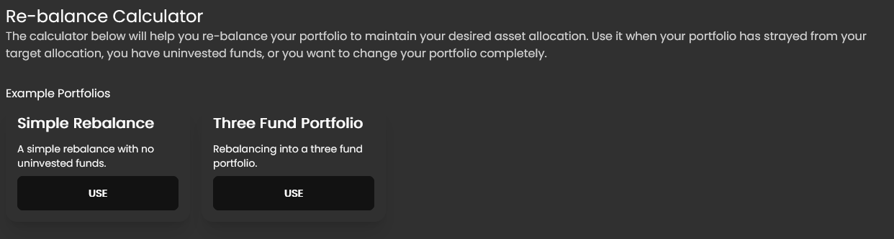
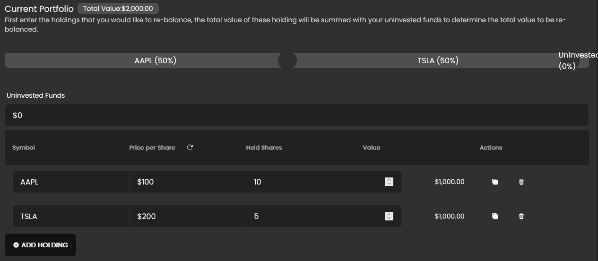
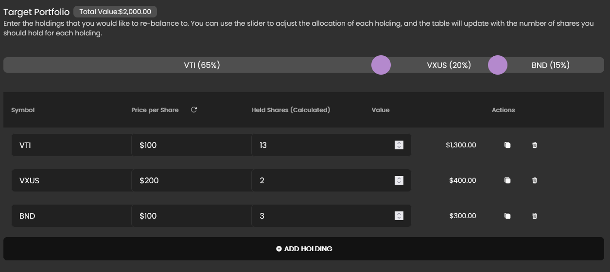
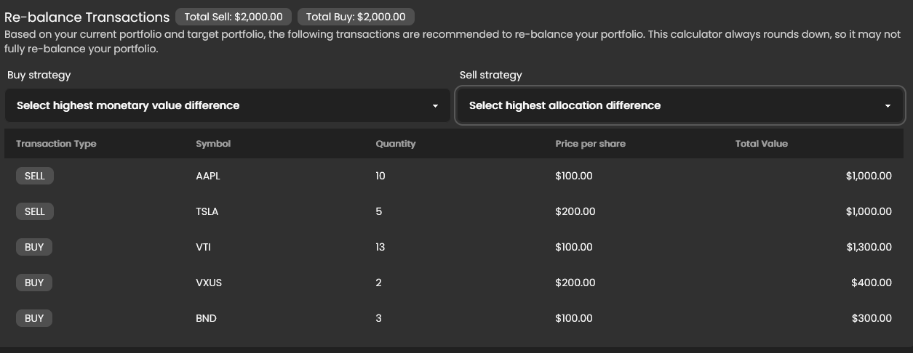

# Re-balance Calculator

This doc will teach you how to use the Re-balance Calculator in Cash Compass.

## Accessing the Re-balance Calculator

1. Open the `Tools` menu in the top navigation bar and click on the `Portfolio Re-balance Calculator` link.
2. The page is split into four sections:
    - **Example Portfolios**: This section provides shortcuts to example portfolios, a great way to get started.
    - **Current Portfolio**: This section allows you to input your current portfolio.
    - **Target Portfolio**: This section allows you to input your target allocation and visualizes the target portfolio.
    - **Re-balance Transactions**: This section shows the transactions you need to make to re-balance your portfolio.

## Example Portfolios

The example portfolios are a great way to get started with the Re-balance Calculator. They are pre-populated with data and you can use them as a starting point to create your own portfolio.

### Simple Rebalance

This portfolio shows a portfolio that is 50% AAPL and 50% TSLA (by value). The target portfolio allocation slider is set to 25% AAPL and 75% TSLA. This means that the target portfolio is 25% AAPL and 75% TSLA. The re-balance transactions show that you need to sell 50% of your AAPL and buy TSLA to get to the target portfolio. Note that the calculator assumes that you can not buy fractional shares, so it rounds down the number of shares to the nearest whole number.

### Three Fund Portfolio

This portfolio just sets the target portfolio to a sensible three fund portfolio. If you're looking into getting into boglehead investing, this is a great place to start.

## Current Portfolio

This section allows you to input your current portfolio. You can add as many stocks as you want by clicking on `Add Holding`. You can also enter into the `Uninvested Funds` field any funds that you have that are not currently invested in the market and want to include in the re-balance.

 The fields are:
| Field Name | Usage |
| ---------- | ----- |
| Symbol | The stock symbol. |
| Price per Share | The price per share to use in the calculation (note, you can click on the refresh icon in the table to fetch the latest price). |
| Held Shares | The number of shares you own. |

With these fields, the table will show the current value of each holding as well as the total value next to the heading of the section.

## Target Portfolio

The target portfolio is composed of a list of holdings and the target allocation for each holding. You can add as many holdings as you want by clicking on `Add Holding`. 

The fields are:
| Field Name | Usage |
| ---------- | ----- |
| Symbol | The stock symbol. |
| Price per Share | The price per share to use in the calculation (note, you can click on the refresh icon in the table to fetch the latest price). |
| Target Allocation | The target allocation for this holding, this is controlled by dragging the slider above the holdings table. |

With these fields, the table will show the target value of each holding as well as the total value next to the heading of the section (this will be the same as the total value in the `Current Portfolio` section).

## Re-balance Transactions

This section shows the transactions you need to make to re-balance your portfolio. It will show the number of shares you need to buy or sell to get to the target portfolio. Note that the calculator assumes that you can not buy fractional shares, so it rounds down the number of shares to the nearest whole number.

You can select the following strategies for buying and selling:
| Strategy | Usage |
| -------- | ----- |
| None | This will prevent buying or selling while still trying to get as close to the target portfolio as possible. |
| Highest allocation difference | This will prioritize buying/selling the holding that has the largest percentage difference between the current allocation and the target allocation. |
| Highest monetary value difference | This will prioritize buying/selling the holding that has the largest monetary difference between the current value and the target value. |

:::info

This tool is intended to be used as a guide. It is not meant to be a replacement for a financial advisor. Before making any trades, ensure that you understand the trades you are making and the potential tax implications.

:::

