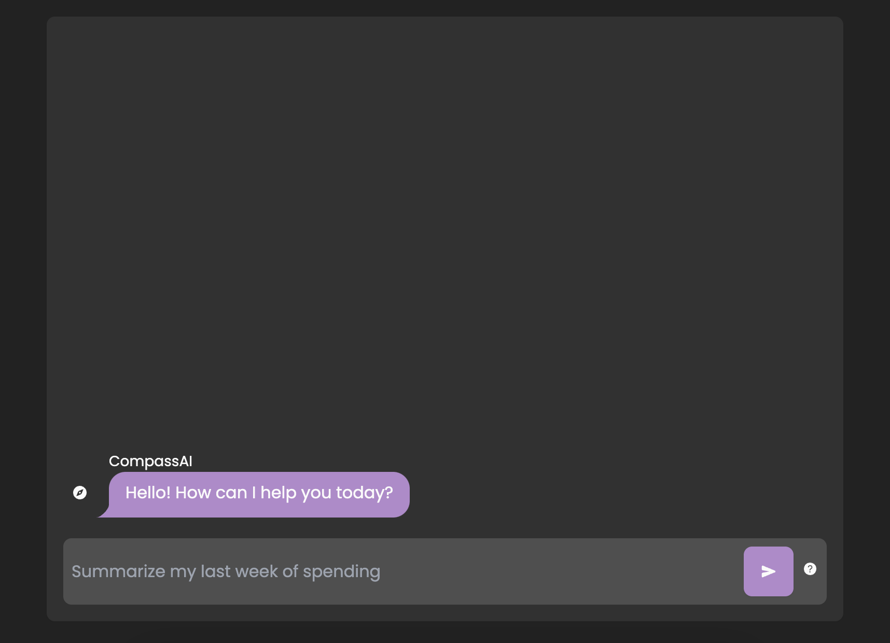

# v0.4.0 Release Notes

## Overview

We're happy to announce the release of Cash Compass v0.4.0, a version that continues to focus on quality and usability improvements.

## Enhancements

### Completed

- **Balance Update History** The account details page now includes a history of balance updates, in the next release we will be adding the ability to edit and delete previously entered balance updates. At the same time we will be updating how balance updates are stored in our database to better scale moving forward.
- **Improved audio input** The audio input in the transaction form now contains a visualization of the audio input and auto-stops when the user stops speaking. [Issue #23](https://github.com/ericdudley/cash-compass-docs/issues/23)
- **Account Balances Graph Timelines:** Enhancements to account balances graph timelines for improved user insights and data visualization. [Issue #20](https://github.com/ericdudley/cash-compass-docs/issues/20)
- **Time zone mismatch detection** Added a check to detect when the user's time zone mismatches the time zone stored in their account. If mismatching, prompts the user with a dialog to update their time zone. [Issue #22](https://github.com/ericdudley/cash-compass-docs/issues/22)

## Bug Fixes

### Completed

- **Category filter in transactions page** Fixed a bug where the category filter in the transactions page was not triggering a re-fetch of the transactions list when a new category was selected. [Issue #16](https://github.com/ericdudley/cash-compass-docs/issues/16)

## Chores

### Completed

- **Email job check ins** Added observability to the daily email job to ensure it is running as expected. [Issue #24](https://github.com/ericdudley/cash-compass-docs/issues/24)
- **Expanded Testing Audit:** Continued the testing audit by greatly increasing the number of functional tests and tooling for writing better tests. [Issue #21](https://github.com/ericdudley/cash-compass-docs/issues/21)

## Looking Ahead

We were able to get back to some enhancements in this release, and we're looking forward to continue more of that in the next release. One key enhancement will be to the transaction form page, optimizing it to load faster and be more user-friendly.

We've also started on a prototype for an upcoming feature, `CompassAI`, look out for a blog post diving into the goals and features of this feature, but for now we can share some early UI prototypes.

## Getting Started with v0.4.0

Ready to use the latest version of Cash Compass? Check it out at [Cash Compass](https://cashcompass.co).

## Support

For any questions or feedback, please don't hesitate to reach out to us at [support@cashcompass.co](mailto:support@cashcompass.co).

Thank you for choosing Cash Compass!